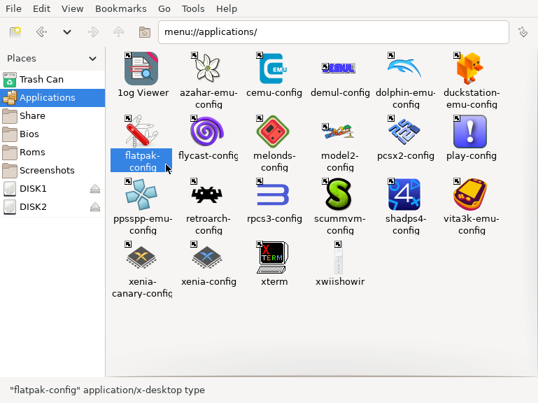
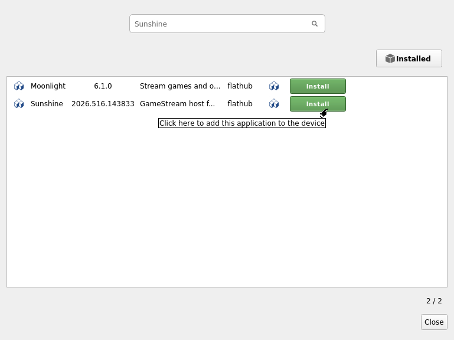
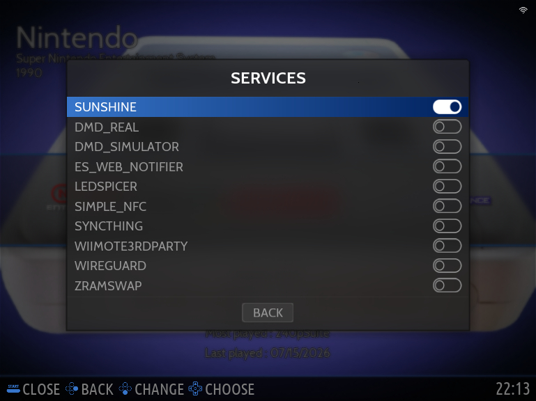

<p align="center">
  
  &nbsp;&nbsp;&nbsp;
  
</p>

<h1 align="center">Sunshine Flatpak Service for Batocera</h1>

<p align="center">Run the official Sunshine Flatpak automatically as a Batocera user service.</p>

## Official documentation

This repository only handles Batocera installation, autostart, diagnostics and the Batocera-specific CSRF setup helper.

For Sunshine configuration, pairing and advanced settings, use the official Sunshine documentation:

https://docs.lizardbyte.dev/projects/sunshine/latest/index.html

For Batocera's Flatpak Manager, use the official Batocera documentation:

https://wiki.batocera.org/systems:flatpak

## What this project does

- Installs Sunshine from Flathub when requested.
- Installs a Batocera user service for starting and stopping Sunshine.
- Enables and starts the service when possible.
- Keeps all project tools in `/userdata/system/sunshine-service/`.
- Provides a guided CSRF helper that trusts only a confirmed blocked origin.
- Provides a diagnostic tool for Flatpak, service, Web UI, logs and encoders.
- Leaves the Sunshine Flatpak and its configuration untouched when the service integration is removed.

## Quick installation

### Recommended

Download the installer and start it automatically:

```bash
curl -fL \
  https://raw.githubusercontent.com/Redemp/batocera-service-sunshine-flatpak/main/install.sh \
  -o /tmp/install-sunshine-service.sh \
  && bash /tmp/install-sunshine-service.sh
```

This is the recommended method for most users. The installer checks whether Sunshine is already installed and offers to install it from Flathub when it is missing.

The downloaded file does not need to be made executable because it is passed directly to `bash`.

### Quick installation using a pipe

```bash
curl -fsSL \
  https://raw.githubusercontent.com/Redemp/batocera-service-sunshine-flatpak/main/install.sh \
  | bash
```

This starts the installer immediately and any prompts are shown in the terminal.

### Optional: inspect before running

Users who prefer to review the installer first can run:

```bash
curl -fL \
  https://raw.githubusercontent.com/Redemp/batocera-service-sunshine-flatpak/main/install.sh \
  -o /tmp/install-sunshine-service.sh

sed -n '1,240p' /tmp/install-sunshine-service.sh

bash /tmp/install-sunshine-service.sh
```

The `sed` command prints the installer in the terminal. Use the terminal scrollback to review earlier lines.

### Fully automatic installation

```bash
curl -fsSL \
  https://raw.githubusercontent.com/Redemp/batocera-service-sunshine-flatpak/main/install.sh \
  | bash -s -- --yes --install-sunshine
```

To install and enable the service without starting Sunshine immediately:

```bash
curl -fsSL \
  https://raw.githubusercontent.com/Redemp/batocera-service-sunshine-flatpak/main/install.sh \
  | bash -s -- --yes --install-sunshine --no-start
```

## Install Sunshine with Batocera's Flatpak Manager

Open **Applications**, launch **flatpak-config**, search for **Sunshine**, then select **Install**.

<p align="center">
  
</p>

<p align="center">
  
</p>

Sunshine may also be installed from SSH:

```bash
flatpak install flathub dev.lizardbyte.app.Sunshine
```

## Installed file layout

```text
/userdata/system/sunshine-service/
├── install.sh
├── sunshine
├── sunshine-csrf-setup
├── sunshine-diagnose
└── uninstall.sh
```

Batocera requires the active service file here:

```text
/userdata/system/services/sunshine
```

No files are installed in `/userdata/system/bin/`.

## Enable the service

The installer attempts to enable the service automatically. It can also be enabled manually under:

```text
MAIN MENU > SYSTEM SETTINGS > SERVICES > SUNSHINE
```

<p align="center">
  
</p>

## Sunshine Web UI

The installer displays the detected address, usually:

```text
https://BATOCERA-IP:47990
```

Sunshine uses a self-signed certificate, so the browser warning is expected.


## Moonlight Client

<p align="center">
  
</p>

After configuring Sunshine, connect to your Batocera system using the official **Moonlight** client.

Official website:

https://moonlight-stream.org/

Moonlight is available for:

- Windows
- Linux
- macOS
- Android
- iPhone / iPad
- Apple TV
- Steam Deck
- Raspberry Pi
- Many Smart TVs

Pair Moonlight with your Batocera system using the PIN displayed during the first connection.

## Recommended Streaming Resolutions

> [!TIP]
> Configure the streaming resolution in the **Moonlight** client. Sunshine will stream at the resolution requested by the client.

For the best experience, configure Moonlight to match the display you are actually using.

For modern widescreen displays, simply select your display's native resolution.

For CRT televisions and CRT monitors, many retro games were originally displayed in a **4:3 aspect ratio**. Choosing a 4:3 streaming resolution avoids stretching and generally provides a more authentic presentation.

### Recommended 4:3 streaming resolutions

| Widescreen Resolution | Recommended 4:3 Resolution |
|----------------------:|---------------------------:|
| 1280×720 | **1280×960** |
| 1920×1080 | **1440×1080** |
| 2560×1440 | **1920×1440** |
| 3840×2160 (4K) | **2880×2160** |

These resolutions preserve the full vertical resolution while converting the image to a true 4:3 aspect ratio.


## CSRF Protection Error

Initial account creation may be blocked when Sunshine receives an origin that is not yet trusted.

First reproduce the error once in the browser, then run:

```bash
/userdata/system/sunshine-service/sunshine-csrf-setup
```

The helper:

1. Reads the latest blocked origin from Sunshine's logs.
2. Displays the exact origin.
3. Asks for confirmation.
4. Updates `sunshine.conf` without removing existing origins.
5. Restarts Sunshine.

A trusted origin may also be supplied manually:

```bash
/userdata/system/sunshine-service/sunshine-csrf-setup \
  --origin https://192.168.1.242:47990
```

Do not add wildcards or untrusted addresses.

## Sunshine's additional setup script

Flathub may suggest:

```bash
flatpak run --command=additional-install.sh dev.lizardbyte.app.Sunshine
```

On Batocera, parts of this generic desktop Linux script may fail because Batocera does not provide the same systemd user session and Flatpak host portal environment. Messages about `org.freedesktop.Flatpak` or `systemctl --user` are therefore possible.

Do not use this command for Sunshine autostart on Batocera:

```text
systemctl --user enable app-dev.lizardbyte.app.Sunshine
```

This repository's Batocera service replaces that autostart step. Mouse, virtual gamepad, UHID and DualSense support should still be tested after pairing Moonlight.

## Diagnostics

Run:

```bash
/userdata/system/sunshine-service/sunshine-diagnose
```

It checks:

- Batocera and Flatpak availability.
- Sunshine installation and version.
- Project and service installation.
- Sunshine process state.
- Local Web UI response on port `47990`.
- Service and Sunshine logs.
- Successful encoder detection.
- Recent CSRF-blocked origins.

Useful manual commands:

```bash
flatpak info dev.lizardbyte.app.Sunshine
flatpak ps
pgrep -af sunshine
flatpak run dev.lizardbyte.app.Sunshine
flatpak kill dev.lizardbyte.app.Sunshine
/userdata/system/services/sunshine status
tail -f /userdata/system/logs/sunshine.log
```

Sunshine's own Flatpak log is normally stored at:

```text
/userdata/saves/flatpak/data/.var/app/dev.lizardbyte.app.Sunshine/config/sunshine/sunshine.log
```

## Updating

Update Sunshine through Batocera's Flatpak Manager or run:

```bash
flatpak update dev.lizardbyte.app.Sunshine
```

Run the installer again to update the Batocera service and helper scripts:

```bash
curl -fsSL \
  https://raw.githubusercontent.com/Redemp/batocera-service-sunshine-flatpak/main/install.sh \
  | bash
```

## Uninstalling the service integration

```bash
/userdata/system/sunshine-service/uninstall.sh
```

This removes the Batocera service and project directory. It does not remove Sunshine or its configuration.

To remove Sunshine separately:

```bash
flatpak uninstall dev.lizardbyte.app.Sunshine
```

## Known limitations

- Sunshine's generic `additional-install.sh` is not fully compatible with Batocera's environment.
- Mouse, virtual gamepad, UHID and DS5 setup may require further Batocera-specific work.
- KMS/DRM capture and hardware encoding depend on the GPU, driver, active connector and permissions.
- This project is community maintained and is not official Batocera or LizardByte software.

## Credits

Inspired by the original `n2qz/batocera-service-sunshine` AppImage service by maximumentropy. This version uses the official Sunshine Flatpak supported through Batocera's Flatpak system.
